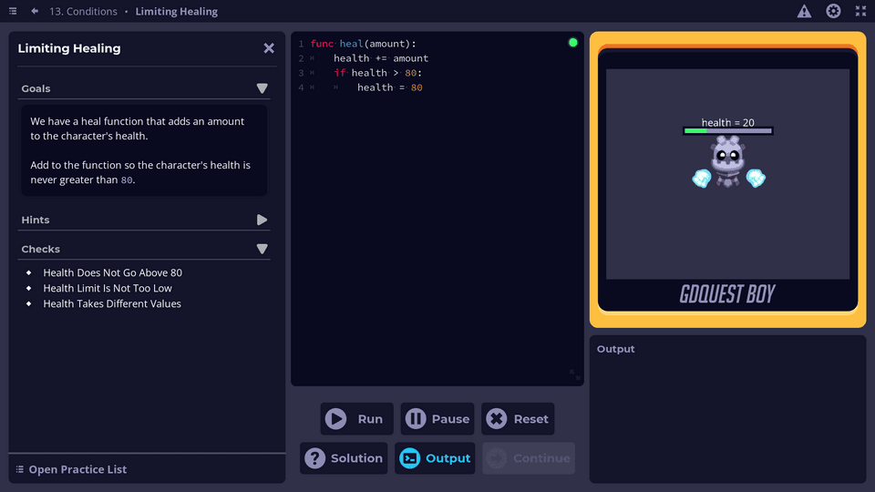
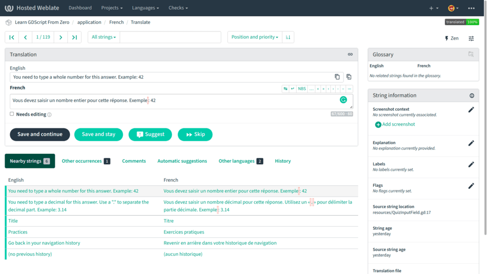
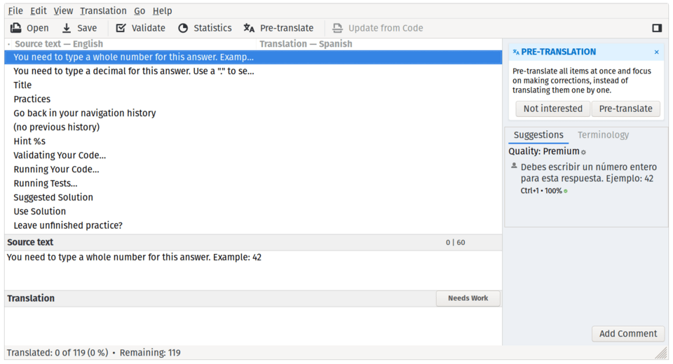

# Working with translations

You can contribute translations to the Free app [Learn GDScript From Zero](https://github.com/GDQuest/learn-gdscript/) in this repository. 



We keep translations separate from the app's source code to simplify the contribution process.

**For now, please don't work on Spanish or French translations. We hired a professional to completely translate the app to both Spanish and French, so your contributions to those two languages would be lost. Thank you for your understanding.**

## How to contribute translations

The app offers internationalization support using PO (gettext) files. It's a popular format among translation professionals, and it has native support in Godot.

### Contributing using Weblate

You can contribute translations using the online program Weblate. It's an excellent open-source online app designed for community-driven translations.



If you decide to use the platform, please check the open pull requests (translation contributions on this translation repository) first: https://github.com/GDQuest/learn-gdscript-translations/pulls

Weblate will not detect and synchronize with those pull requests until we integrate them into the repository. If there is an open pull request for your target language, please coordinate with contributors and us to avoid losing work.

If there is no open pull request for your desired language, you can get started on Weblate right away.

Translate the app using Weblate today: https://hosted.weblate.org/projects/learn-gdscript-from-zero/

We warmly thank Weblate for giving us access to their free hosted plan for open source projects.

### Adding translations to PO files

To contribute translations, open the subdirectory corresponding to your target language. For example, `es/` for Spanish.

_Note: we hired a professional translator to translate the app to Spanish fully, so we currently don't need contributions in Spanish._

There, you'll find PO translation files. To edit those, you'll need a dedicated program.

There are several free and open-source translation programs you can use to translate PO files. We recommend [Poedit](https://poedit.net/) as it's available on all three major desktop platforms and it offers an accessible interface.



Among other features, it allows you to mark translations you're unsure of as "needing work" so another translator can check it before publishing it.

If the directory for your language doesn't exist, you'll need to create it. You should create a directory with the two-letter code corresponding to your language. For example, `fr/` for French and `zh/` for Chinese.

There, you'll need to create PO translation files for your target language from the POT template files. If you need help with that, please ask. We'll be happy to set them up for you.

### Testing your translations in Godot

You'll want to check your translations in Godot when translating the app. To do so, you need to copy your PO files over to the app's repository: [learn-gdscript](https://github.com/GDQuest/learn-gdscript/).

First, you'll want to import the project in Godot.

Then, run the app by pressing <kbd>F5</kbd>, open the settings menu, and select the target language. The app will remember your choice when you reopen it.

Once you add many new translations, you can rerun the app to check their length doesn't cause overflowing or other UI issues. As words become longer or shorter in different languages, it's crucial to ensure the interface takes that into account.

If any bug appears in the interface with new translations, please [open a new issue](https://github.com/GDQuest/learn-gdscript/issues) and include a screenshot so we can fix it.

Finally, please note that if the app is running when you save translations, they may not reload in real-time. In that case, you'll need to close the app by pressing <kbd>F8</kbd> in Godot and rerun it by pressing <kbd>F5</kbd>.

## Translation files

We split translations for each language into many files. It helps translators to focus on a single lesson or aspect of the app at a time:

* `application.*` contains all translatable strings from the UI of the app. Note that this also includes placeholder text which we sometimes add to our reusable components.
* `classref_database.*` contains entries for the documentation section of the practice side panel, a class reference of sorts that explains some methods and properties to the student. It is based on `course/documentation.csv`.
* `error_database.*` contains explanations and suggestions for GDScript and internal errors. It is based on `lsp/error_database.csv`.
* `lesson-*.*` files contain all translatable strings from the course content. Currently, only content blocks, quizzes, and practices are translated. We currently don't support translatable content in scripts and scenes used by lessons.

## How translations work in Godot and the app

The engine automatically translates UI nodes, while we need to wrap string literals in calls to the `tr()` function.

In your typical Godot project, you would preload translation resources through the project settings.

Instead, this app loads translations dynamically because we separate localization resources into several files per supported language. This applies to both POT files (translation templates) and translated PO files.

### Updating translation templates

The gettext translation format comes with two file extensions: POT for translation templates and PO for translations to a specific language.

PO files derive from POT files, which allow us to track strings that changed between releases finely.

To update POT files, you need to have `babel` and `babel-godot` installed for Python, following [recommendations](https://docs.godotengine.org/en/stable/tutorials/i18n/localization_using_gettext.html#creating-the-po-template-pot-using-pybabel) from the official Godot documentation.

We use a python script to extract docstrings. You can call it from the root of the project like so:

```
python ./i18n/extract.py
```
