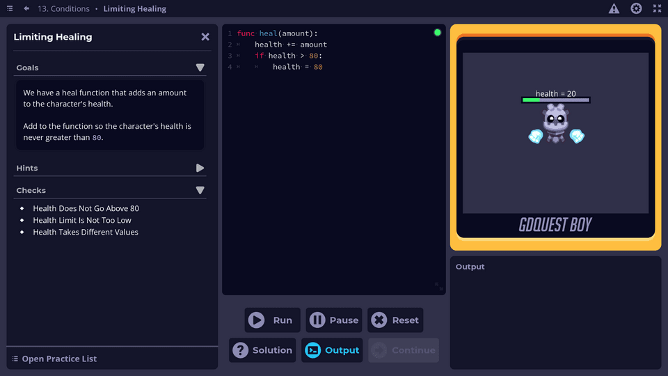
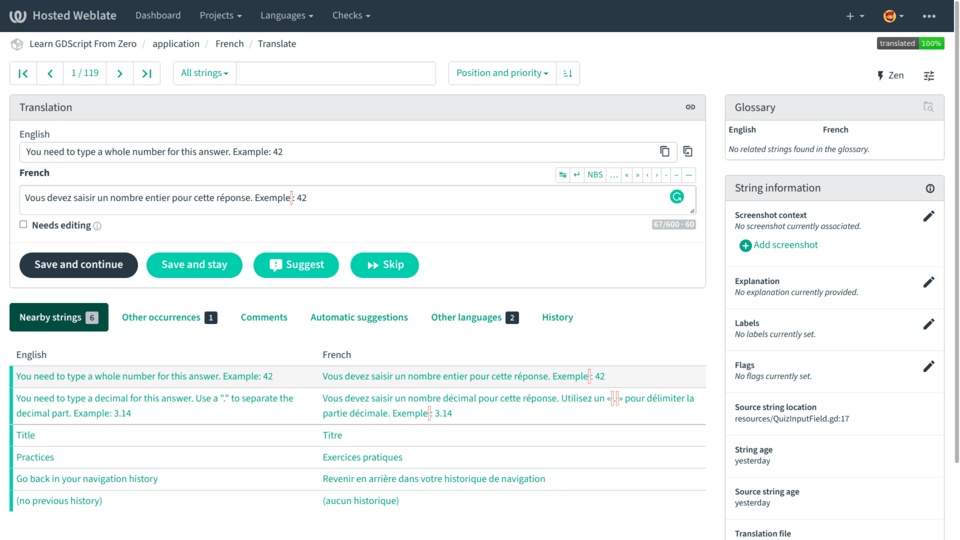
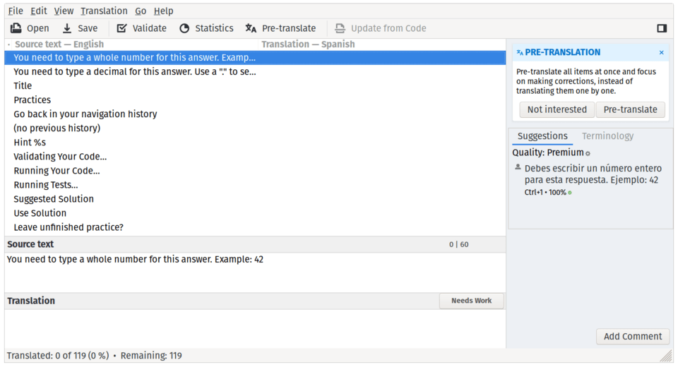

# Contributing translations to Learn GDScript From Zero

This repository is where we store and update the translations for the app [Learn GDScript From Zero](https://github.com/GDQuest/learn-gdscript/). This guide explains how to participate in the community contributed translations.

But first, thank you for your interest in translating Learn GDScript From Zero! This free and open-source app teaches GDScript to programming beginners, and your translations help make it accessible to more people around the world.

## Getting started

There are two ways to contribute to the translations. The easiest way to contribute is through Weblate, an online translation website. If you're already comfortable with Git and pull requests, you can also edit the PO translation files directly.

### Option 1: Translate with Weblate (recommended)

Weblate is a free, open-source web app designed for community-driven translations. You can start translating right in your browser with no setup needed.

Click the following link to head over to the Weblate project page and pick your language: https://hosted.weblate.org/projects/learn-gdscript-from-zero/

When you add translations on Weblate, it automatically opens a pull request on this repository and adds your changes as new commits. You don't need to do anything else: we'll review and merge your contributions from there.

### Option 2: Edit PO files manually

This option is for contributors who are comfortable with using Git and creating pull requests on GitHub. If you don't have experience with that, we recommend using Weblate instead.

The app uses PO (gettext) files for translations. It's a popular format among translation professionals, and Godot supports it natively. You can use any program that supports PO files to edit them.

To get started:

1. Open the subdirectory for your target language (for example, `es/` for Spanish or `fr/` for French).
2. Edit the PO files using a dedicated translation editor. We recommend [Poedit](https://poedit.net/) as it's free, works on Windows, macOS, and Linux, and has a really simple interface.
3. Save your changes. This will update the PO files and allow you to commit them with git.

When you're done, submit your changes as a pull request.

Poedit lets you mark translations you're unsure about as "needing work" so another translator can review them later.

If the directory for your language doesn't exist yet, create one using the two-letter ISO language code (like `fr/` for French or `ko/` for Korean). You'll also need to create PO files from the POT template files in the root of this repository. If you need help with that, feel free to open an issue and we'll set them up for you.

## Structure of translation files

We split translations into a few set of files per language:

- `application.*` has all text from the app's user interface and practice checks, including some placeholder text in reusable components.
- `supplementary.*` has documentation entries that appear in the practice side panel to explain methods and properties, glossary entries for detailed explanation of terminology, and explanations and suggestions for GDScript errors and internal errors.
- `course.*` has the content of all the course lessons, quizzes, and practices.

## Testing your translations in Godot

If you want to see how your translations look in the app, here's how you can test them locally. You'll need to clone the app's repository: [learn-gdscript](https://github.com/GDQuest/learn-gdscript/). Check the repository for requirements - it uses a custom build of Godot.

1. Copy your translated PO files into the app's repository. You need to put them in the `i18n/` directory, following the same structure as this repository. For example, if you translated into Spanish, you would copy your `es/` directory with all its PO files into the `i18n/` directory of the app's repository.
2. Open the project in Godot.
3. Build the lessons by using the `Project/Tools/i18n Tools/Build Translated Lessons`.
4. Run the app by pressing <kbd>F5</kbd>.
5. Open the settings menu and select your language. The app will remember your choice next time.

As you add translations, rerun the app every now and then to check that longer or shorter words don't cause the interface to overflow or break. Different languages have very different word lengths, and this can affect the user interface.

If you find a UI bug caused by translations, please [open a new issue](https://github.com/GDQuest/learn-gdscript/issues) on the app's repository and include a screenshot so we can fix it.

**Note:** Currently, the app won't automatically reload translations while it's running. If you update a PO file, close the app with <kbd>F8</kbd> and rerun it with <kbd>F5</kbd>.

## For maintainers: updating translation templates

This section is mainly for maintainers or code contributors to Learn GDScript From Zero.

The gettext format uses two file types: POT files are translation templates, and PO files are translations for a specific language. PO files are derived from POT files, which lets us track which strings changed between releases.

To update POT files, you need to clone the app's repository ([learn-gdscript](https://github.com/GDQuest/learn-gdscript/)). Check the repository for requirements - it uses a custom build of Godot.

Then, once the editor is open, you can run the extraction script by using the `Project/Tools/i18n Tools/Generate All POT files` shortcut.
